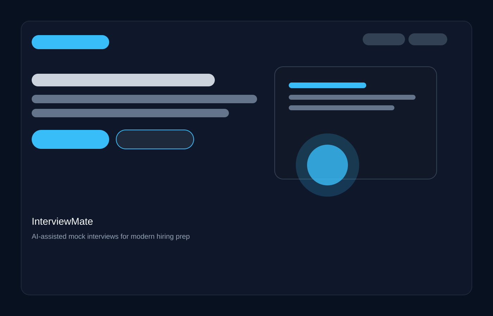
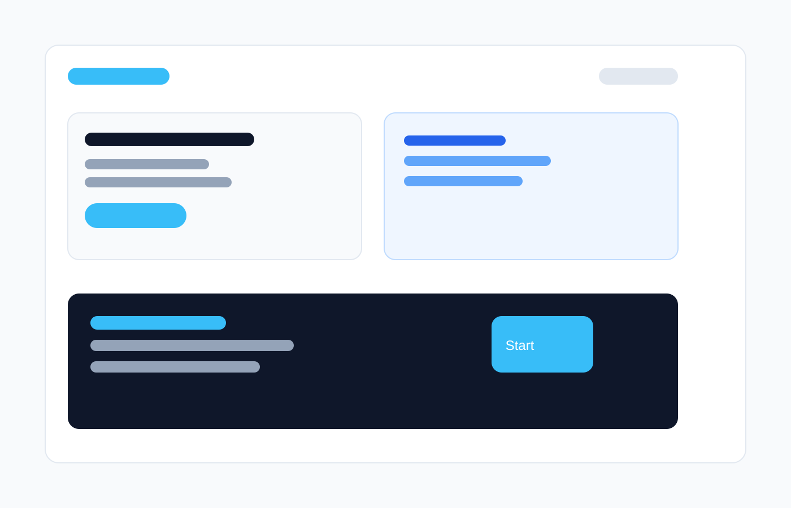
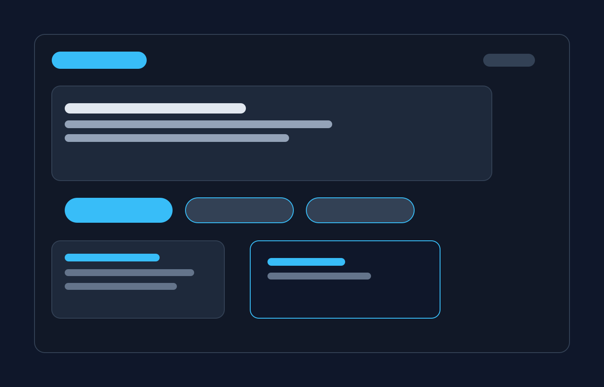
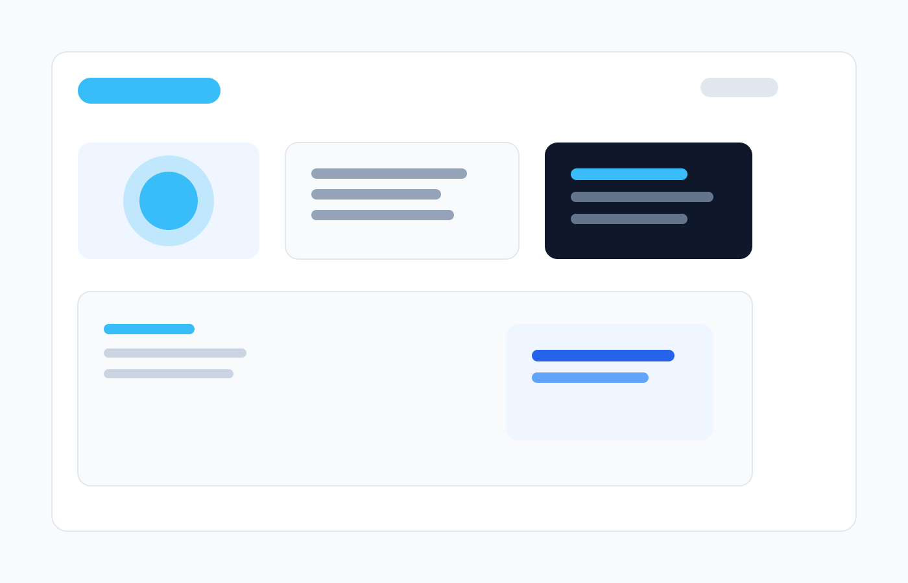

# InterviewMate

InterviewMate is a modern interview preparation platform that helps users practice for technical and behavioral interviews through AI-generated questions, timed sessions, and structured feedback.

## What it does

- Simulates realistic interview sessions with dynamic questions
- Supports multiple interview formats, including coding and MCQ-based rounds
- Provides a polished dashboard for tracking progress and performance
- Helps users prepare with a guided, interactive experience

## Features

- AI-powered interview flow
- Timed question sessions
- Progress tracking and results overview
- Responsive web experience for desktop and mobile

## Screenshots

## Tech stack

- Frontend: React + Vite
- Backend: Python + FastAPI
- Styling: CSS and component-based UI

## Getting started

1. Clone the repository
2. Install frontend dependencies with `npm install`
3. Install backend dependencies with `pip install -r backend/requirements.txt`
4. Start the frontend and backend services locally

## Project structure

- `frontend/` contains the React app
- `backend/` contains the API and interview logic
- `docs/screenshots/` contains the GitHub showcase images
