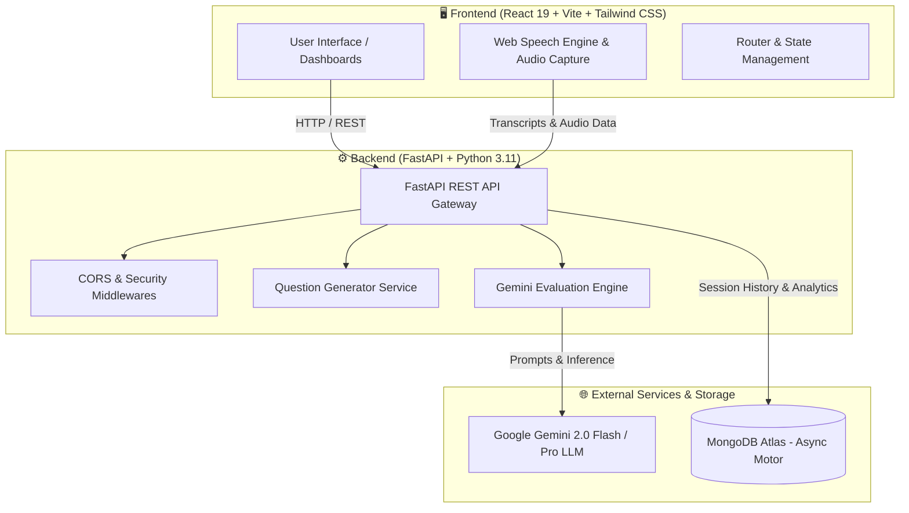

<div align="center">

# 🎯 InterviewMate
### *The Ultimate AI-Powered Interview Preparation & Assessment Platform*

[](https://aiinterviewmate.vercel.app/)
[](https://github.com/siddharthagits/InterviewMate/stargazers)
[](https://github.com/siddharthagits/InterviewMate/network/members)
[](https://opensource.org/licenses/MIT)

<br/>

[](https://react.dev/)
[](https://fastapi.tiangolo.com/)
[](https://ai.google.dev/)
[](https://tailwindcss.com/)
[](https://www.mongodb.com/)
[](https://vitejs.dev/)
[](https://www.python.org/)

<br/>

**InterviewMate** is an intelligent, full-stack interview readiness ecosystem engineered to transform technical, behavioral, and company-specific interview preparation. Powered by **Google Gemini AI**, it delivers realistic voice simulation, adaptive mock testing, automated code and speech evaluation, and personalized career roadmaps.

[🚀 Explore Live Demo](https://aiinterviewmate.vercel.app/) • [✨ Key Features](#-key-features) • [🏗️ Architecture](#-system-architecture) • [⚡ Quick Start](#-quick-start-guide) • [🔌 API Docs](#-api-endpoints)

</div>

---

## 📑 Table of Contents

- [✨ Key Features](#-key-features)
- [🏗️ System Architecture](#-system-architecture)
- [🛠️ Tech Stack](#️-tech-stack)
- [📂 Project Structure](#-project-structure)
- [⚡ Quick Start Guide](#-quick-start-guide)
  - [Prerequisites](#prerequisites)
  - [1. Clone the Repository](#1-clone-the-repository)
  - [2. Backend Setup](#2-backend-setup)
  - [3. Frontend Setup](#3-frontend-setup)
- [🔐 Environment Variables](#-environment-variables)
- [🔌 API Endpoints](#-api-endpoints)
- [🗺️ Roadmap](#️-roadmap)
- [🤝 Contributing](#-contributing)
- [📄 License & Acknowledgments](#-license--acknowledgments)

---

## ✨ Key Features

<table>
  <tr>
    <td width="50%">
      <h3>🎙️ Interactive Voice AI Interviewer</h3>
      <ul>
        <li>Realistic audio conversation with conversational AI interviewer</li>
        <li>Real-time Speech-to-Text and voice synthesis powered by Web Speech API</li>
        <li>Metrics for speech clarity, pace, confidence, and filler word detection</li>
        <li>Actionable verbal and behavioral interview critique</li>
      </ul>
    </td>
    <td width="50%">
      <h3>🏢 Company-Targeted Assessments</h3>
      <ul>
        <li>Exam simulations tailored to top tech giants (Google, Amazon, Microsoft, TCS, Infosys, Meta, etc.)</li>
        <li>Dynamic round simulation: Coding, Technical MCQs, Core CS, and System Design</li>
        <li>Timed test environment with realistic industry grading metrics</li>
      </ul>
    </td>
  </tr>
  <tr>
    <td width="50%">
      <h3>📚 Subject-Wise Question Banks</h3>
      <ul>
        <li>Extensive repository covering DSA, System Design, OS, DBMS, Networks, OOPs, Web Development, and more</li>
        <li>Detailed AI explanations on demand for complex questions</li>
        <li>Filter by difficulty, topic, and question types</li>
      </ul>
    </td>
    <td width="50%">
      <h3>⚡ Developer Typing Test</h3>
      <ul>
        <li>Tailored code & technical typing drills</li>
        <li>Live WPM, character accuracy, error highlighting, and speed progression</li>
        <li>Enhances programming agility and speed during timed live interviews</li>
      </ul>
    </td>
  </tr>
  <tr>
    <td width="50%">
      <h3>🤖 Deep Gemini 2.0 AI Evaluation</h3>
      <ul>
        <li>Instant automated scoring with multidimensional rubrics</li>
        <li>Identifies strengths, critical gaps, and optimized solutions</li>
        <li>Model answer generation with time/space complexity analysis</li>
      </ul>
    </td>
    <td width="50%">
      <h3>📊 Performance Analytics & History</h3>
      <ul>
        <li>Complete history of completed interview sessions stored in MongoDB Atlas</li>
        <li>Historical trends, radar metrics, and weak spot diagnostics</li>
        <li>Downloadable / reviewable session reports</li>
      </ul>
    </td>
  </tr>
</table>

---

## 🏗️ System Architecture



---

## 🛠️ Tech Stack

| Domain | Technologies |
| :--- | :--- |
| **Frontend** | React 19, Vite, Tailwind CSS v4, React Router 7, Axios, React Hook Form |
| **Backend** | FastAPI, Python 3.11+, Uvicorn, Pydantic v2, Python-Dotenv |
| **AI / Machine Learning** | Google Gemini 2.0 (`google-genai` SDK), Prompt Engineering, Web Speech API |
| **Database** | MongoDB Atlas, Motor (Async MongoDB Driver) |
| **Deployment & DevOps** | Vercel (Frontend), Render (Backend), CI/CD Ready |

---

## 📂 Project Structure

```text
InterviewMate/
├── backend/
│   ├── app/
│   │   ├── routes/
│   │   │   └── interview.py        # Interview session & question endpoints
│   │   ├── schemas/
│   │   │   └── interview.py        # Pydantic validation schemas
│   │   ├── services/
│   │   │   └── question_service.py # Question synthesis & bank handlers
│   │   ├── database.py             # MongoDB connection & lifecycle management
│   │   ├── gemini_service.py       # Google Gemini LLM evaluation & fallback logic
│   │   └── main.py                 # FastAPI application entry & CORS middleware
│   ├── requirements.txt            # Python dependencies
│   ├── render.yaml                 # Render infrastructure deployment blueprint
│   └── .env.example                # Backend environment template
├── frontend/
│   ├── src/
│   │   ├── api/                    # Axios API configuration & endpoints
│   │   ├── components/             # Reusable UI components (Navbar, Modal, Cards)
│   │   ├── context/                # Global state & authentication providers
│   │   ├── data/                   # Mock exams, companies & question bank presets
│   │   ├── pages/                  # Page views:
│   │   │   ├── Home.jsx            # Landing page
│   │   │   ├── Dashboard.jsx       # User stats & session management
│   │   │   ├── Interview.jsx       # Standard interview runner
│   │   │   ├── VoiceInterview.jsx  # Voice AI real-time simulation
│   │   │   ├── CompanyExamTest.jsx # Company assessment simulator
│   │   │   ├── TypingTest.jsx      # Code typing speed tester
│   │   │   ├── Results.jsx         # AI evaluation reports & scorecards
│   │   │   └── QuestionBank.jsx    # Subject test browser
│   │   ├── App.jsx                 # Route definitions
│   │   ├── index.css               # Tailwind CSS styles & design tokens
│   │   └── main.jsx                # React root entry
│   ├── package.json                # Frontend scripts & dependencies
│   ├── vite.config.js              # Vite bundler configuration
│   └── .env.example                # Frontend environment template
└── README.md                       # Repository documentation
```

---

## ⚡ Quick Start Guide

### Prerequisites

Make sure you have the following installed on your machine:
- **Node.js**: `v18.0.0` or later ([Download Node.js](https://nodejs.org/))
- **Python**: `v3.11.0` or later ([Download Python](https://www.python.org/))
- **MongoDB Atlas** account (or local MongoDB instance)
- **Google Gemini API Key** ([Get your API Key from Google AI Studio](https://aistudio.google.com/))

---

### 1. Clone the Repository

```bash
git clone https://github.com/siddharthagits/InterviewMate.git
cd InterviewMate
```

---

### 2. Backend Setup

1. **Navigate to the backend directory**:
   ```bash
   cd backend
   ```

2. **Create and activate a virtual environment**:
   ```bash
   # Windows (PowerShell)
   python -m venv venv
   .\venv\Scripts\Activate.ps1

   # macOS / Linux
   python3 -m venv venv
   source venv/bin/activate
   ```

3. **Install dependencies**:
   ```bash
   pip install -r requirements.txt
   ```

4. **Configure environment variables**:
   Create a `.env` file in the `backend/` directory:
   ```env
   GEMINI_API_KEY=your_google_gemini_api_key
   MONGODB_URL=mongodb+srv://<username>:<password>@<cluster>.mongodb.net/
   MONGODB_DATABASE=interviewmate
   ALLOWED_ORIGINS=http://localhost:5173,http://127.0.0.1:5173
   ```

5. **Start the FastAPI server**:
   ```bash
   uvicorn app.main:app --reload --port 8000
   ```
   > 🚀 Backend will be running at `http://localhost:8000`  
   > 📖 Interactive Swagger docs available at `http://localhost:8000/docs`

---

### 3. Frontend Setup

1. **Open a new terminal and navigate to the frontend directory**:
   ```bash
   cd frontend
   ```

2. **Install Node dependencies**:
   ```bash
   npm install
   ```

3. **Configure environment variables**:
   Create a `.env` file in the `frontend/` directory:
   ```env
   VITE_GEMINI_API_KEY=your_google_gemini_api_key
   VITE_API_URL=http://localhost:8000
   ```

4. **Start the Vite development server**:
   ```bash
   npm run dev
   ```
   > 🌐 Frontend will be accessible at `http://localhost:5173`

---

## 🔐 Environment Variables

### Backend (`backend/.env`)
| Variable | Required | Description |
| :--- | :---: | :--- |
| `GEMINI_API_KEY` | **Yes** | Google Gemini API key for question synthesis & evaluation |
| `MONGODB_URL` | **Yes** | MongoDB Atlas connection string |
| `MONGODB_DATABASE` | No | Database name (defaults to `interviewmate`) |
| `ALLOWED_ORIGINS` | No | Comma-separated list of allowed CORS origins |

### Frontend (`frontend/.env`)
| Variable | Required | Description |
| :--- | :---: | :--- |
| `VITE_GEMINI_API_KEY` | **Yes** | Google Gemini API key for client-side AI services |
| `VITE_API_URL` | No | Base URL for FastAPI backend (defaults to `http://localhost:8000`) |

---

## 🔌 API Endpoints

| Method | Endpoint | Description |
| :--- | :--- | :--- |
| `GET` | `/` | Health check & API status |
| `POST` | `/generate-questions` | Generates role, difficulty, and topic-specific interview questions |
| `POST` | `/evaluate` | Evaluates user answers using Google Gemini AI and provides comprehensive scores |
| `POST` | `/explain-question` | Generates deep explanations, code examples, and trade-offs for a question |
| `POST` | `/interview-sessions` | Persists a completed interview session to MongoDB |
| `GET` | `/interview-sessions` | Fetches historical interview records with optional user filtering |
| `GET` | `/interview-sessions/{id}` | Retrieves detailed report of a specific interview session |

---

## 🗺️ Roadmap

- [x] Full-featured voice interview simulation with real-time Speech-to-Text
- [x] Company-specific exams (FAANG, MAANG & WITCH patterns)
- [x] Multi-tier evaluation engine with Google Gemini 2.0
- [x] Integrated technical typing speed tester
- [ ] **AI Resume Scanner & JD Matcher**: Automatic tailored question generation from uploaded resumes
- [ ] **Video Facial Cue & Eye Contact Feedback**: Real-time camera analysis for posture and engagement
- [ ] **P2P Mock Interview Rooms**: Live collaborative peer coding and video sessions
- [ ] **Multi-language Support**: Multi-lingual interview practice for global opportunities

---

## 🤝 Contributing

Contributions are what make the open-source community an incredible place to learn, inspire, and create! Any contributions you make are **greatly appreciated**.

1. **Fork the Project**
2. **Create your Feature Branch** (`git checkout -b feature/AmazingFeature`)
3. **Commit your Changes** (`git commit -m 'feat: Add some AmazingFeature'`)
4. **Push to the Branch** (`git push origin feature/AmazingFeature`)
5. **Open a Pull Request**

---

## 📄 License & Acknowledgments

Distributed under the **MIT License**. See `LICENSE` for more details.

Built with ❤️ by [Siddhartha](https://github.com/siddharthagits)

<div align="center">
  <sub>⭐ If you find InterviewMate helpful, please star the repository! ⭐</sub>
</div>
